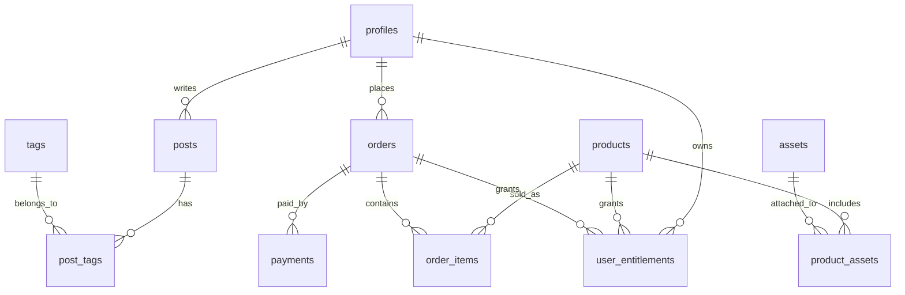

# Habitree 마스터 기획서

> **Habitree**(vibe.habitree.io) — AI·바이브코딩·독서로 읽고 만들고 연결하는 개인 브랜드 플랫폼의
> 단일 마스터 문서. **Part Ⅰ**은 코드·배포로 확인된 *현재 정본*이고, **Part Ⅱ**는 원본 기획의
> *상세 설계·계획*(커머스 ERD·RLS·성공지표·LINKMAP 템플릿)을 보존한 참조부다.
> 초기 코드네임은 "Creator Link Hub". 통합 경위·괴리는 [`_consolidation_plan.md`](./_consolidation_plan.md).
>
> **표기**: ✅ 구현됨 · 🟡 부분 · ⬜ 계획. "구현됨"은 코드·마이그레이션으로 확인된 것만.
> 최종 통합: 2026-07-22

---

# Part Ⅰ — 현재 정본 (구현 반영)

## 1. 프로젝트 정의

### 1.1 명칭
- **Habitree** (약칭 **HT**) — 사용자 대면 정식 브랜드.
- 기획 코드네임: "Creator Link Hub"(초기 문서에만 등장, 신규 사용 안 함).
- 저장소/배포 식별자: `vibe_stater`(GitHub) · `vibe-stater`(Vercel).

### 1.2 핵심 목적
1. 운영자 개인 브랜드("바이브코딩 치트키") 소개·신뢰 구축
2. 전자책·강의·컨설팅·자료의 콘텐츠 및 (향후) 판매 기반
3. ReadTree·YouTube 콘텐츠 유입 경로
4. LINKMAP의 실제 사용 사례이자 바이브코딩 교육의 실습 프로젝트

### 1.3 제품 포지션
단순 랜딩이 아니라 **회원·콘텐츠·후원·문의·관리자**를 갖춘 소형 개인 플랫폼.
현재 수익 모델은 **자율 후원(Polar) + 1:1 커피챗**이며, 상품 판매(커머스)는 계획 단계.

---

## 2. 브랜드·도메인 규칙 (혼동 방지)

| 층위 | 값 | 규칙 |
|---|---|---|
| 브랜드(대면) | **Habitree** / `vibe.habitree.io` | 모든 카피·문서 표준. 정본 상수: `src/lib/site.ts` |
| 저장소/프로젝트 | `vibe_stater`·`vibe-stater` | 기술 식별자로만 |
| 코드네임 | Creator Link Hub | 이력 각주 전용 |

- **`.io` = 운영 도메인**, **`.ai` = 계정·조직(`habitree-ai`)·이메일·폴더**. `habitree.ai`는 미등록(NXDOMAIN)이라 **도메인으로 쓰면 실장애**(로그인 DNS 오류 이력, WORKLOG 2026-06-25).
- 코드에서 도메인 단일 출처는 `site.url`(`vibe.habitree.io`). `NEXT_PUBLIC_APP_URL`이 잘못돼 있어 신뢰하지 않음(`layout.tsx` 주석).

---

## 3. 서비스맵 · 기술 스택 (실제)

| 구분 | 서비스 | 상태 | 연동 방식 |
|---|---|---|---|
| 프레임워크 | **Next.js 16.2.9** / React 19 | ✅ | App Router. `AGENTS.md`: 훈련 데이터와 다른 버전이니 `node_modules/next/dist/docs/` 확인 |
| 배포/호스팅 | **Vercel** | ✅ | `main` push 자동배포. `.vercel/repo.json` |
| 인증·DB·스토리지 | **Supabase** | ✅ | `@supabase/ssr`. 프로젝트 `ofxzkwbqwpsjoeqjhrpl` |
| 후원 결제 | **Polar** | ✅ | SDK 없이 raw fetch(`api/donate`·`polar-webhook`) |
| AI | **OpenAI** `gpt-4o-mini` | ✅ | raw fetch(`api/chat`), 설정 DB `chat_settings` |
| 이메일 | **Resend** | ✅ | raw fetch(`src/lib/notify.ts`) |
| 알림 | **카카오톡**(나에게 보내기) | ✅ | raw fetch, 토큰 DB `notification_tokens` |
| 분석 | PostHog | ⬜ | 미도입 |
| 유입 | YouTube · ReadTree(`read.habitree.io`) | 🟡 | CTA 링크 |
| 환경관리 | LINKMAP | ⬜ | 연동 미도입(개념 참조) |

> 스택 특징: 외부 연동을 **SDK 없이 raw HTTP(fetch)** 로 최소 구현 → `package.json` 의존성은 Supabase + Next/React + UI만. 결제/AI/메일 SDK 없음.

---

## 4. 정보구조(IA) — 구현 라우트 + 계획

### 4.1 공개/회원 페이지
| URL | 설명 | 상태 |
|---|---|---|
| `/` | 메인(디자인 v2) | ✅ |
| `/about` | 소개 | ✅ |
| `/projects` | 서비스(LINKMAP·ReadTree) | ✅ |
| `/posts` · `/posts/[slug]` | 저널/글 | ✅ (샘플 데이터 SSG) |
| `/products` · `/products/[slug]` | 자료/상품 카탈로그 | 🟡 (표시만, 결제 파이프라인 없음) |
| `/education` · `/guides` | 교육·가이드 | ✅ |
| `/support` | 후원(Polar) | ✅ |
| `/coffee-chat` | 1:1 커피챗 신청 | ✅ |
| `/contact` | 문의(+메일·카카오 알림) | ✅ |
| `/login` · `/signup` · `/me` | 인증·마이페이지(아바타) | ✅ |
| `/kakao-oauth` | 카카오 토큰 1회 연동 | ✅ |
| `/terms` · `/privacy` | 약관·개인정보 | ✅ |
| `/me/orders` · `/me/library` | 구매내역·자료실 | ⬜ 계획(커머스) |

### 4.2 관리자 `/admin/*` (role=admin)
| URL | 설명 | 상태 |
|---|---|---|
| `/admin` | 관리자 허브 | ✅ |
| `/admin/coffee-chat` | 커피챗 관리 | ✅ |
| `/admin/contact` | 문의 관리(삭제) | ✅ |
| `/admin/subscribers` (+`/export`) | 뉴스레터 구독자·CSV | ✅ |
| `/admin/characters` | 캐릭터 자산 관리 | ✅ |
| `/admin/settings` | AI 챗봇 설정 | ✅ |
| `/admin/logs` | 활동 로그 | ✅ |

### 4.3 API·기타
`/api/chat`(OpenAI) · `/api/donate`·`/api/polar-webhook`(Polar) · `/api/newsletter` · `/auth/callback` · `/c/[code]`(캐릭터 리다이렉트) — 모두 ✅

---

## 5. 데이터 모델 (현재)

마이그레이션 0001~0015, ✅ 적용됨.

| 테이블 | 역할 |
|---|---|
| `profiles` | 사용자 프로필·role(user/admin) |
| `coffee_chat_requests` | 1:1 커피챗 신청(취소·시퀀스 포함) |
| `contact_messages` | 문의(+phone, 레이트리밋) |
| `newsletter_subscribers` | 뉴스레터 구독 |
| `donations` | Polar 후원 결제 기록 |
| `chat_settings` | AI 챗봇 모델·지침 |
| `character_assets` | 캐릭터 자산(HT-### 채번) |
| `notification_tokens` | 카카오 access/refresh |
| `activity_logs` | 운영 활동 로그 |

Storage 버킷: `avatars`, 캐릭터 자산 버킷.
> 커머스용 테이블(`products`·`orders`·`payments`·`user_entitlements`·`posts`·`tags`·`assets`)은 **Part Ⅱ §B**의 설계를 상품 판매 단계에서 도입한다. 현재 콘텐츠는 `src/data/sample.ts` 정적 데이터.

---

## 6. 기능 현황 매트릭스

| 영역 | 기능 | 상태 |
|---|---|---|
| 인증 | 회원가입·로그인·마이페이지·role | ✅ |
| 콘텐츠 | 저널/자료 목록·상세 | 🟡 (정적, DB화 예정) |
| 후원 | Polar 결제·웹훅·기록 | ✅ |
| 상품 판매 | 카탈로그·체크아웃·권한·자료실 | ⬜ |
| 문의 | 접수 + 메일(Resend)·카카오 알림 | ✅ |
| 뉴스레터 | 구독·구독자 관리·CSV | ✅ |
| 커피챗 | 신청·관리·취소 | ✅ |
| AI 챗봇 | OpenAI, 관리자 설정 | ✅ |
| 캐릭터 | HT-### 채번·대시보드·리다이렉트 | ✅ |
| 전자책 | 초보자 A4 5쪽 | ✅ |
| 관리자 | 허브·각 도메인 관리 | ✅ |
| 분석 | PostHog | ⬜ |
| LINKMAP 공개맵 | 서비스맵 페이지 | ⬜ |

---

## 7. 배포·운영

- **Vercel** `main` push 자동배포 → `vibe.habitree.io`. `scripts/ship.ps1`(=`npm run ship`)은 `git push`만.
- 배포 관련 파일: `next.config.ts`(표준 Next). `vercel.json`·wrangler·open-next·GitHub Actions **없음**.
- 배포 정본 문서: [`13_vercel_deployment.md`](./13_vercel_deployment.md). 폐기된 Cloudflare 이력은 [`archive/`](./archive/).

---

## 8. 환경변수
단일 소스: [`10_env_config_registry.md`](./10_env_config_registry.md). 요약 — Supabase 3키 · Polar 4키 · OpenAI 1키 · Resend 2키 · Kakao 2키(+토큰 DB) · `NEXT_PUBLIC_APP_URL`·`ADMIN_EMAIL`. 배포 등록처는 **Vercel → Environment Variables**.

---

## 9. 로드맵 (현행)
상세: [`04_roadmap.md`](./04_roadmap.md).
- ✅ Step 0~3(환경·메인·하위 페이지·인증/DB)
- ✅ Step 6 대부분(문의·뉴스레터·커피챗·AI 챗봇)
- 🟡 Step 4(콘텐츠 DB화)
- ⬜ Step 5(커머스 판매, Polar 상품) · 분석 · LINKMAP 공개맵 · Step 7(교육화·템플릿)

---

## 10. 디자인 기준
정본: [`14_homepage_v2_personality.md`](./14_homepage_v2_personality.md)("사람이 만든 티" v2). `01`(토큰 v0)·`05`(v1)은 이력.
토큰 소스: `globals.css`(`.home-v2` 스코프). 브랜드 그린 계열, Pretendard.

---

## 11. 하위 문서 인덱스
전체 지도: [`README.md`](./README.md). 기능 스펙 — 전자책 [`16`](./16_ebook_beginner_plan.md) · 캐릭터 [`17`](./17_character_platform.md) · 알림 [`18`](./18_contact_notifications.md) · 고도화 기록 [`15`](./15_site_enhancement_2026-07.md).

---
---

# Part Ⅱ — 상세 설계·계획 (원본 기획 보존)

> 아래는 초기 기획의 설계 자산이다. 상당수(커머스 도메인)는 아직 **⬜ 계획**이며, 상품 판매 단계에서
> 이 설계를 기준으로 구현한다. 현재 구현된 것은 Part Ⅰ이 정본이다.

## A. 목적별 IA 원안 (참조)

```text
소개 · 콘텐츠 · 서비스 · 상품 · 교육 · 회원 · 문의 · 관리자
```
원안의 상세 사이트맵/URL 표는 Part Ⅰ §4가 실제 라우트로 대체한다. 아직 미구현 영역(구매·자료실 등)은
아래 커머스 설계를 따른다.

## B. 커머스 ERD (⬜ 계획)

상품 판매 도입 시 생성할 도메인·테이블. 현재 미생성.



### B-1. products
| 컬럼 | 타입 | 설명 |
|---|---|---|
| id | uuid PK | 상품 ID |
| name / slug | text | 상품명 / URL slug |
| product_type | text | `ebook`·`course`·`template`·`consulting`·`subscription` |
| price_amount / currency | numeric / text | 가격 / KRW·USD |
| status | text | `draft`·`active`·`hidden`·`archived` |
| description_md | text | 상품 설명 |
> 결제 연동 컬럼은 **Polar** 기준(예: `polar_product_id`)으로 정의한다. 원안의 `stripe_price_id`는 폐기.

### B-2. posts / tags / assets
- `posts`: title·slug·excerpt·content_md·visibility(`public`/`members`/`buyers`/`private`)·status·cover_image_url·published_at
- `tags` + `post_tags`(N:M)
- `assets`: title·asset_type(`pdf`·`zip`·`image`·`video`·`template`·`link`)·storage_path·mime_type·file_size·access_level(`public`/`members`/`buyers`/`admin`)

### B-3. orders / order_items / payments / user_entitlements
- `orders`(헤더) · `order_items`(상세) · `payments`(결제 이벤트, provider=`polar`) 분리.
- `user_entitlements`: user_id·product_id·order_id·entitlement_type(`download`·`course_access`·`membership`·`consulting`)·starts_at·expires_at·status.

## C. 상품 판매 MVP 범위 (⬜ 계획)

| 우선순위 | 기능 | 비고 |
|---|---|---|
| P0 | 상품 등록/상세 | products CRUD |
| P0 | Polar 단건 결제 | 전자책/템플릿 판매 |
| P0 | 구매자 자료실 | 결제 → 권한 → 다운로드 |
| P1 | 관리자 상품 관리 | 운영 가능성 |
| P2 | 구독 결제·강의 진도·쿠폰 | 후순위 |

## D. 화면 구조 원안 (참조)
- **상품 상세**: 상품명/결과물 → 대상 → 포함 내용 → 미리보기 → 가격/구매 → 이용 방법 → FAQ.
- **마이페이지**: 프로필 · 구매 내역 · 다운로드 자료 · 수강 교육 · 뉴스레터 설정 · 문의 내역.
- **관리자 대시보드**: 오늘 방문/가입/구매/문의 · 최근 주문·문의 · 인기 콘텐츠 · 환경/서비스 상태.

## E. LINKMAP 템플릿 설계 (⬜ 상품화 계획)
템플릿명 **Creator Business Platform Template**. 포함: Next.js·Supabase(Auth/DB/Storage)·Vercel·**Polar**·Resend(권장)·OpenAI(선택)·YouTube/ReadTree(선택). 각 서비스별 셋업 체크리스트는 [`10_env_config_registry.md`](./10_env_config_registry.md) 및 [`service-setup/`](./service-setup/) 방법론을 상품화한다.

## F. 권한/RLS 정책 원칙 (설계)
| 데이터 | 방문자 | 로그인 | 구매자 | 관리자 |
|---|---:|---:|---:|---:|
| 공개 글 | 읽기 | 읽기 | 읽기 | CRUD |
| 회원전용 글 | 불가 | 읽기 | 읽기 | CRUD |
| 구매자전용 글 | 불가 | 불가 | 읽기 | CRUD |
| 상품 | 읽기 | 읽기 | 읽기 | CRUD |
| 주문 | 불가 | 본인 | 본인 | 전체 |
| 파일 | 공개만 | 회원 | 구매 | CRUD |
| 문의 | 생성 | 본인 | 본인 | 전체 |
> 현재 구현된 테이블(profiles·contact_messages·coffee_chat_requests 등)의 RLS는 마이그레이션에 이미 적용됨. 위 표는 커머스 도입 시 확장 기준.

## G. 성공 지표 (목표)
| 구분 | 지표 | 목표 |
|---|---|---|
| 브랜드 | 월 방문자 | 1차 1,000명 |
| 콘텐츠 | CTA 클릭률 | 3%+ |
| 회원 | 방문자→회원 | 5%+ |
| 판매 | 무료→유료 전환 | 2%+ |
| 교육 | 템플릿 사용 | 1차 30명 |
| 운영 | 문의 전환 | 월 5건+ |

---

## 결론
Habitree는 단순 개인 홈페이지가 아니라 **서비스 연결·환경변수 관리·바이브코딩 온보딩**을 실제 사례로
보여주는 실습형 개인 플랫폼이다. 현재는 후원·문의·콘텐츠·AI·캐릭터·전자책까지 운영 중이며, 다음
단계는 **콘텐츠 DB화 → 상품 판매(Polar 커머스) → 교육 템플릿화**다.
