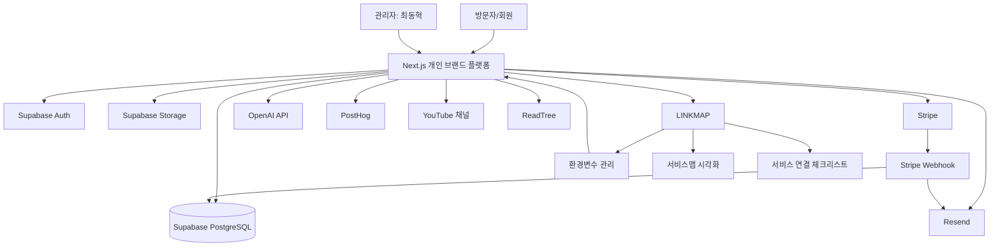

# LINKMAP 부가서비스: 개인 브랜드 플랫폼 구축 기획서

문서 목적: LINKMAP의 부가서비스/교육 콘텐츠로 활용할 수 있는 **개인 브랜드 랜딩페이지 + 회원/콘텐츠/판매/교육 관리 플랫폼**의 정보구조(IA), 서비스맵, ERD를 정의한다.

---

## 1. 프로젝트 정의

### 1.1 프로젝트명
**Creator Link Hub**  
부제: LINKMAP으로 만드는 나만의 서비스형 개인 플랫폼

### 1.2 핵심 목적
1. 최동혁 개인 브랜드 소개 및 가치 제고
2. 전자책, 강의, 컨설팅, 자료 판매 기반 구축
3. ReadTree와 YouTube 콘텐츠 유입 경로 구축
4. LINKMAP의 실제 사용 사례 확보
5. 바이브코딩 교육 커리큘럼의 실습 프로젝트로 활용

### 1.3 제품 포지션
이 플랫폼은 단순 랜딩페이지가 아니라 다음 기능을 갖는 **소형 SaaS형 개인 비즈니스 플랫폼**이다.

- 공개 랜딩페이지
- 회원가입/로그인
- 콘텐츠/자료실
- 상품 판매
- 결제
- 뉴스레터
- 문의/상담 신청
- 관리자 페이지
- LINKMAP 서비스맵/환경변수 관리 연동

---

## 2. 전체 서비스맵

### 2.1 서비스 구성 요약

| 구분 | 서비스 | 역할 | LINKMAP 관리 대상 |
|---|---|---|---|
| 프론트엔드 | Next.js | 웹앱/랜딩페이지 | O |
| 호스팅 | Vercel | 배포/도메인/환경변수 | O |
| 인증 | Supabase Auth | 회원가입/로그인/OAuth | O |
| DB | Supabase PostgreSQL | 사용자/콘텐츠/상품/주문 DB | O |
| 스토리지 | Supabase Storage | 자료 파일/썸네일/첨부파일 | O |
| 결제 | Stripe | 상품 결제/구독/웹훅 | O |
| 이메일 | Resend | 가입/구매/문의/뉴스레터 발송 | O |
| AI | OpenAI API | 콘텐츠 요약/추천/챗봇 | O |
| 분석 | PostHog | 유입/전환/행동 분석 | O |
| 영상 유입 | YouTube | 콘텐츠 유입 채널 | 부분 |
| 독서 서비스 | ReadTree | 연계 서비스/CTA | 부분 |
| 환경관리 | LINKMAP | 서비스 연결/환경변수/체크리스트 | 핵심 |

---

## 3. 서비스맵 다이어그램



### 3.1 데이터 흐름

| 흐름 | 설명 |
|---|---|
| 방문자 → 플랫폼 | 소개, 콘텐츠, 상품, ReadTree/LINKMAP CTA 확인 |
| 방문자 → 회원가입 | Supabase Auth로 계정 생성 |
| 회원 → 콘텐츠 | 공개/회원전용/구매자전용 콘텐츠 접근 |
| 회원 → 상품 구매 | Stripe Checkout 또는 Payment Element 사용 |
| Stripe → Webhook | 결제 성공/실패/환불 이벤트 수신 |
| Webhook → DB | 주문, 결제상태, 권한 업데이트 |
| Webhook → Resend | 구매확인, 자료 다운로드 안내 메일 발송 |
| 플랫폼 → LINKMAP | 프로젝트 구조, 서비스 연결, 환경변수 관리 사례 공개/교육화 |
| 플랫폼 → ReadTree | 독서/필사 서비스 유입 |
| YouTube → 플랫폼 | 영상 설명/고정댓글/CTA를 통한 유입 |

---

## 4. 정보구조(IA)

### 4.1 최상위 사이트맵

```text
/
├─ 소개
│  ├─ 프로필
│  ├─ 경력/이력
│  ├─ 프로젝트
│  └─ 협업/문의
│
├─ 콘텐츠
│  ├─ 블로그
│  ├─ 유튜브 콘텐츠 정리
│  ├─ AI/독서/바이브코딩 아카이브
│  └─ 무료 자료
│
├─ 서비스
│  ├─ LINKMAP 소개
│  ├─ ReadTree 소개
│  ├─ 제작 사례
│  └─ 서비스맵 보기
│
├─ 상품
│  ├─ 전자책
│  ├─ 강의
│  ├─ 템플릿
│  ├─ 컨설팅
│  └─ 구매 상세
│
├─ 교육
│  ├─ 바이브코딩 실습 과정
│  ├─ LINKMAP으로 서비스 연결하기
│  ├─ Supabase 설정
│  ├─ Stripe 설정
│  ├─ Resend 설정
│  └─ 배포/운영
│
├─ 회원
│  ├─ 로그인
│  ├─ 회원가입
│  ├─ 비밀번호 재설정
│  ├─ 마이페이지
│  ├─ 내 구매내역
│  ├─ 내 자료실
│  └─ 뉴스레터 설정
│
├─ 문의
│  ├─ 상담 신청
│  ├─ 제휴 문의
│  └─ 일반 문의
│
└─ 관리자
   ├─ 대시보드
   ├─ 회원 관리
   ├─ 콘텐츠 관리
   ├─ 상품 관리
   ├─ 주문/결제 관리
   ├─ 문의 관리
   ├─ 뉴스레터 관리
   ├─ 파일 관리
   ├─ LINKMAP 연동 관리
   └─ 설정
```

### 4.2 URL 구조

| 영역 | URL | 설명 | 인증 |
|---|---|---|---|
| 홈 | `/` | 메인 랜딩페이지 | 공개 |
| 소개 | `/about` | 개인 소개 | 공개 |
| 경력 | `/about/career` | 이력/경력/성과 | 공개 |
| 프로젝트 | `/projects` | LINKMAP, ReadTree 등 | 공개 |
| 블로그 | `/posts` | 글 목록 | 공개 |
| 글 상세 | `/posts/[slug]` | 글 상세 | 공개/제한 가능 |
| 자료실 | `/resources` | 무료/유료 자료 목록 | 혼합 |
| 상품 목록 | `/products` | 판매 상품 목록 | 공개 |
| 상품 상세 | `/products/[slug]` | 상품 상세/구매 CTA | 공개 |
| 결제 | `/checkout/[productId]` | 결제 페이지 | 로그인 권장 |
| 결제 성공 | `/checkout/success` | 구매 완료 | 로그인 |
| 로그인 | `/login` | 로그인 | 비회원 |
| 회원가입 | `/signup` | 회원가입 | 비회원 |
| 마이페이지 | `/me` | 내 정보 | 로그인 |
| 내 구매내역 | `/me/orders` | 주문/결제 내역 | 로그인 |
| 내 자료실 | `/me/library` | 구매/다운로드 가능 자료 | 로그인 |
| 문의 | `/contact` | 문의/상담 신청 | 공개 |
| 관리자 | `/admin` | 관리자 홈 | 관리자 |
| 관리자 콘텐츠 | `/admin/posts` | 콘텐츠 CRUD | 관리자 |
| 관리자 상품 | `/admin/products` | 상품 CRUD | 관리자 |
| 관리자 주문 | `/admin/orders` | 주문 관리 | 관리자 |
| 관리자 문의 | `/admin/inquiries` | 문의 관리 | 관리자 |

---

## 5. ERD 개요

### 5.1 핵심 도메인

1. 사용자/권한 도메인
2. 콘텐츠 도메인
3. 상품/결제 도메인
4. 파일/자료 도메인
5. 문의/리드 도메인
6. 뉴스레터 도메인
7. LINKMAP 연동 도메인
8. 분석/활동 로그 도메인

### 5.2 ERD 다이어그램

```mermaid
erDiagram
    profiles ||--o{ posts : writes
    profiles ||--o{ orders : places
    profiles ||--o{ inquiries : submits
    profiles ||--o{ user_entitlements : owns
    profiles ||--o{ activity_logs : performs

    posts ||--o{ post_tags : has
    tags ||--o{ post_tags : belongs_to

    products ||--o{ product_assets : includes
    assets ||--o{ product_assets : attached_to
    products ||--o{ order_items : sold_as
    products ||--o{ user_entitlements : grants

    orders ||--o{ order_items : contains
    orders ||--o{ payments : paid_by
    orders ||--o{ user_entitlements : grants

    inquiries ||--o{ inquiry_messages : has

    newsletter_subscribers ||--o{ newsletter_events : receives

    linkmap_projects ||--o{ linkmap_services : contains
    linkmap_projects ||--o{ linkmap_env_refs : manages

    profiles {
      uuid id PK
      text email
      text name
      text avatar_url
      text role
      text status
      timestamptz created_at
      timestamptz updated_at
    }

    posts {
      uuid id PK
      uuid author_id FK
      text title
      text slug
      text excerpt
      text content_md
      text visibility
      text status
      text cover_image_url
      timestamptz published_at
      timestamptz created_at
      timestamptz updated_at
    }

    tags {
      uuid id PK
      text name
      text slug
      text type
    }

    post_tags {
      uuid post_id FK
      uuid tag_id FK
    }

    products {
      uuid id PK
      text name
      text slug
      text product_type
      numeric price_amount
      text currency
      text status
      text stripe_price_id
      text description_md
      timestamptz created_at
      timestamptz updated_at
    }

    assets {
      uuid id PK
      text title
      text asset_type
      text storage_path
      text mime_type
      int file_size
      text access_level
      timestamptz created_at
    }

    product_assets {
      uuid product_id FK
      uuid asset_id FK
      int sort_order
    }

    orders {
      uuid id PK
      uuid user_id FK
      text order_no
      text status
      numeric total_amount
      text currency
      text stripe_checkout_session_id
      timestamptz ordered_at
    }

    order_items {
      uuid id PK
      uuid order_id FK
      uuid product_id FK
      numeric unit_price
      int quantity
      numeric subtotal
    }

    payments {
      uuid id PK
      uuid order_id FK
      text provider
      text provider_payment_id
      text status
      numeric amount
      text raw_event_json
      timestamptz paid_at
    }

    user_entitlements {
      uuid id PK
      uuid user_id FK
      uuid product_id FK
      uuid order_id FK
      text entitlement_type
      timestamptz starts_at
      timestamptz expires_at
      text status
    }

    inquiries {
      uuid id PK
      uuid user_id FK
      text name
      text email
      text inquiry_type
      text status
      text subject
      text message
      timestamptz created_at
    }

    inquiry_messages {
      uuid id PK
      uuid inquiry_id FK
      text sender_type
      text message
      timestamptz created_at
    }

    newsletter_subscribers {
      uuid id PK
      uuid user_id FK
      text email
      text status
      text source
      timestamptz subscribed_at
    }

    newsletter_events {
      uuid id PK
      uuid subscriber_id FK
      text event_type
      text campaign_id
      timestamptz created_at
    }

    linkmap_projects {
      uuid id PK
      text name
      text external_project_id
      text description
      text visibility
      timestamptz created_at
    }

    linkmap_services {
      uuid id PK
      uuid linkmap_project_id FK
      text service_name
      text service_category
      text status
      jsonb metadata
    }

    linkmap_env_refs {
      uuid id PK
      uuid linkmap_project_id FK
      text env_key
      text environment
      text service_name
      bool is_secret
      text status
    }

    activity_logs {
      uuid id PK
      uuid user_id FK
      text action
      text target_type
      uuid target_id
      jsonb metadata
      timestamptz created_at
    }
```



---

## 6. 테이블 상세 설계

### 6.1 profiles
Supabase Auth의 `auth.users`와 1:1로 연결되는 사용자 프로필.

| 컬럼 | 타입 | 설명 |
|---|---|---|
| id | uuid PK | auth.users.id 참조 |
| email | text | 이메일 |
| name | text | 표시 이름 |
| avatar_url | text | 프로필 이미지 |
| role | text | `user`, `admin` |
| status | text | `active`, `blocked`, `deleted` |
| created_at | timestamptz | 생성일 |
| updated_at | timestamptz | 수정일 |

### 6.2 posts
블로그, 유튜브 원고 정리, 교육 콘텐츠, 공지사항을 통합 관리.

| 컬럼 | 타입 | 설명 |
|---|---|---|
| id | uuid PK | 글 ID |
| author_id | uuid FK | 작성자 |
| title | text | 제목 |
| slug | text unique | URL slug |
| excerpt | text | 요약 |
| content_md | text | Markdown 본문 |
| visibility | text | `public`, `members`, `buyers`, `private` |
| status | text | `draft`, `published`, `archived` |
| cover_image_url | text | 대표 이미지 |
| published_at | timestamptz | 발행일 |

### 6.3 products
전자책, 강의, 템플릿, 컨설팅 상품을 통합 관리.

| 컬럼 | 타입 | 설명 |
|---|---|---|
| id | uuid PK | 상품 ID |
| name | text | 상품명 |
| slug | text unique | URL slug |
| product_type | text | `ebook`, `course`, `template`, `consulting`, `subscription` |
| price_amount | numeric | 가격 |
| currency | text | KRW/USD |
| status | text | `draft`, `active`, `hidden`, `archived` |
| stripe_price_id | text | Stripe Price ID |
| description_md | text | 상품 설명 |

### 6.4 assets
무료/유료 자료 파일, 썸네일, PDF, 템플릿 등을 관리.

| 컬럼 | 타입 | 설명 |
|---|---|---|
| id | uuid PK | 파일 ID |
| title | text | 파일명/자료명 |
| asset_type | text | `pdf`, `zip`, `image`, `video`, `template`, `link` |
| storage_path | text | Supabase Storage 경로 |
| mime_type | text | MIME 타입 |
| file_size | int | 파일 크기 |
| access_level | text | `public`, `members`, `buyers`, `admin` |

### 6.5 orders / order_items / payments
Stripe 결제와 플랫폼 내부 주문을 분리 관리한다.

| 테이블 | 역할 |
|---|---|
| orders | 주문 헤더 |
| order_items | 주문 상세 상품 |
| payments | 결제 이벤트/상태 |

### 6.6 user_entitlements
사용자가 어떤 상품/자료/강의 접근 권한을 갖는지 관리한다.

| 컬럼 | 타입 | 설명 |
|---|---|---|
| id | uuid PK | 권한 ID |
| user_id | uuid FK | 사용자 |
| product_id | uuid FK | 상품 |
| order_id | uuid FK | 주문 |
| entitlement_type | text | `download`, `course_access`, `membership`, `consulting` |
| starts_at | timestamptz | 시작일 |
| expires_at | timestamptz | 종료일 nullable |
| status | text | `active`, `expired`, `revoked` |

---

## 7. MVP 범위

### 7.1 반드시 구현할 기능

| 우선순위 | 기능 | 이유 |
|---|---|---|
| P0 | 랜딩페이지 | 개인 브랜드/서비스 소개의 시작점 |
| P0 | 회원가입/로그인 | 자료실/구매자 권한의 기반 |
| P0 | 블로그/콘텐츠 | YouTube/ReadTree/Linkmap 유입 자산 |
| P0 | 상품 등록/상세 | 판매 구조의 기반 |
| P0 | Stripe 단건 결제 | 전자책/템플릿 판매 가능 |
| P0 | 구매자 자료실 | 결제 후 파일 제공 |
| P0 | 관리자 상품/콘텐츠 관리 | 운영 가능성 확보 |
| P1 | 문의/상담 신청 | 컨설팅 전환 경로 |
| P1 | 뉴스레터 구독 | 장기 고객 관계 구축 |
| P1 | LINKMAP 서비스맵 공개 페이지 | 교육/홍보 차별점 |

### 7.2 MVP에서 제외할 기능

| 기능 | 제외 이유 | 추후 단계 |
|---|---|---|
| 구독 결제 | 초기 복잡도 증가 | Phase 2 |
| 강의 진도율 | LMS 복잡도 증가 | Phase 2 |
| 커뮤니티 | 운영 부담 | Phase 3 |
| AI 챗봇 | 핵심 검증 후 적용 | Phase 2 |
| 쿠폰/프로모션 | 초기에는 수동 처리 가능 | Phase 2 |
| 정산/세금 자동화 | 초기 거래량 확인 후 | Phase 3 |

---

## 8. 화면 구조

### 8.1 공개 홈

섹션 구성:
1. Hero: “AI 시대, 읽고 만들고 연결하는 개인 플랫폼”
2. 소개: 최동혁의 경력/관점/전문성
3. 핵심 프로젝트: LINKMAP, ReadTree, YouTube
4. 판매 상품: 전자책/템플릿/강의
5. 최신 콘텐츠: 블로그/영상 정리
6. 교육 CTA: 바이브코딩으로 나만의 서비스 만들기
7. 뉴스레터/문의 CTA

### 8.2 상품 상세

섹션 구성:
1. 상품명/핵심 결과물
2. 누구를 위한 상품인가
3. 포함 내용
4. 미리보기
5. 가격/구매 버튼
6. 구매 후 이용 방법
7. FAQ

### 8.3 마이페이지

섹션 구성:
1. 프로필 정보
2. 구매 내역
3. 다운로드 가능한 자료
4. 수강 가능한 교육
5. 뉴스레터 수신 설정
6. 문의 내역

### 8.4 관리자 대시보드

섹션 구성:
1. 오늘 방문/가입/구매/문의 요약
2. 최근 주문
3. 최근 문의
4. 인기 콘텐츠
5. LINKMAP 연결 상태
6. 환경변수 누락/서비스 상태 경고

---

## 9. LINKMAP 템플릿 설계

### 9.1 템플릿명
**Creator Business Platform Template**

### 9.2 포함 서비스

| 서비스 | 필수 여부 | 설명 |
|---|---|---|
| Next.js | 필수 | 앱 프레임워크 |
| Supabase Auth | 필수 | 회원가입/로그인 |
| Supabase PostgreSQL | 필수 | DB |
| Supabase Storage | 필수 | 자료 파일 저장 |
| Vercel | 필수 | 배포 |
| Stripe | 필수 | 결제 |
| Resend | 권장 | 이메일 |
| PostHog | 권장 | 분석 |
| OpenAI | 선택 | AI 기능 |
| YouTube | 선택 | 유입 채널 |
| ReadTree | 선택 | 연계 서비스 |

### 9.3 LINKMAP 체크리스트 예시

#### Supabase
- [ ] Supabase 프로젝트 생성
- [ ] Auth URL 설정
- [ ] Google/GitHub OAuth 활성화 여부 결정
- [ ] profiles 테이블 생성
- [ ] RLS 정책 적용
- [ ] Storage bucket 생성
- [ ] 환경변수 등록

#### Stripe
- [ ] Stripe 계정 생성
- [ ] Product/Price 생성
- [ ] Webhook endpoint 생성
- [ ] `checkout.session.completed` 이벤트 연결
- [ ] Webhook secret 환경변수 등록
- [ ] 테스트 결제 확인

#### Resend
- [ ] 도메인 인증
- [ ] API Key 생성
- [ ] 발신 이메일 설정
- [ ] 구매완료 이메일 템플릿 생성
- [ ] 문의 접수 이메일 템플릿 생성

#### Vercel
- [ ] GitHub 저장소 연결
- [ ] Production 환경변수 등록
- [ ] Preview 환경변수 등록
- [ ] Custom domain 연결
- [ ] 배포 확인

---

## 10. 환경변수 설계

```bash
# Supabase
NEXT_PUBLIC_SUPABASE_URL=
NEXT_PUBLIC_SUPABASE_ANON_KEY=
SUPABASE_SERVICE_ROLE_KEY=

# App
NEXT_PUBLIC_APP_URL=
ADMIN_EMAIL=

# Stripe
STRIPE_SECRET_KEY=
NEXT_PUBLIC_STRIPE_PUBLISHABLE_KEY=
STRIPE_WEBHOOK_SECRET=

# Resend
RESEND_API_KEY=
RESEND_FROM_EMAIL=

# OpenAI
OPENAI_API_KEY=

# PostHog
NEXT_PUBLIC_POSTHOG_KEY=
NEXT_PUBLIC_POSTHOG_HOST=

# Linkmap
LINKMAP_PROJECT_ID=
LINKMAP_API_TOKEN=
```

---

## 11. 개발 우선순위

### Phase 1: 기반 구축
1. Next.js 프로젝트 생성
2. Supabase Auth 연결
3. profiles 테이블/RLS 구성
4. 홈/소개/프로젝트 페이지 구현
5. 관리자 권한 구분

### Phase 2: 콘텐츠/자료 구조
1. posts 테이블 구현
2. tags 구현
3. 관리자 글 작성 화면
4. 공개 블로그 목록/상세
5. assets 테이블/Storage 연결

### Phase 3: 상품/결제
1. products 테이블 구현
2. 상품 목록/상세
3. Stripe Checkout 연결
4. Webhook 처리
5. orders/payments/user_entitlements 생성
6. 구매자 자료실 구현

### Phase 4: 운영/전환
1. 문의/상담 신청
2. 뉴스레터 구독
3. Resend 이메일 발송
4. PostHog 이벤트 추적
5. LINKMAP 서비스맵 공개 페이지

### Phase 5: 교육화
1. 각 구축 과정을 강의 모듈로 분리
2. LINKMAP 체크리스트화
3. 템플릿으로 패키징
4. YouTube 콘텐츠와 연결
5. ReadTree/Linkmap CTA 삽입

---

## 12. 개발 태스크 백로그

| ID | 태스크 | 우선순위 | 산출물 |
|---|---|---|---|
| T-001 | 프로젝트 초기 세팅 | P0 | Next.js 앱 |
| T-002 | Supabase 연결 | P0 | Auth/DB 연결 |
| T-003 | profiles 테이블/RLS | P0 | 사용자 프로필 |
| T-004 | 홈 IA 구현 | P0 | 랜딩페이지 |
| T-005 | posts CRUD | P0 | 블로그 관리 |
| T-006 | products CRUD | P0 | 상품 관리 |
| T-007 | assets Storage | P0 | 파일 업로드/다운로드 |
| T-008 | Stripe Checkout | P0 | 결제 플로우 |
| T-009 | Stripe Webhook | P0 | 결제 후 권한 부여 |
| T-010 | 마이페이지 | P0 | 구매자료 확인 |
| T-011 | 문의 기능 | P1 | 상담 신청 |
| T-012 | Resend 이메일 | P1 | 알림 메일 |
| T-013 | PostHog 이벤트 | P1 | 분석 이벤트 |
| T-014 | LINKMAP 서비스맵 페이지 | P1 | 공개 사례 페이지 |
| T-015 | 교육 모듈 페이지 | P1 | 커리큘럼 소개 |

---

## 13. 권한/RLS 정책 원칙

| 데이터 | 일반 방문자 | 로그인 사용자 | 구매자 | 관리자 |
|---|---:|---:|---:|---:|
| 공개 글 | 읽기 | 읽기 | 읽기 | CRUD |
| 회원전용 글 | 불가 | 읽기 | 읽기 | CRUD |
| 구매자전용 글 | 불가 | 불가 | 읽기 | CRUD |
| 상품 | 읽기 | 읽기 | 읽기 | CRUD |
| 주문 | 불가 | 본인만 읽기 | 본인만 읽기 | 전체 읽기 |
| 파일 | 공개 파일만 | 회원 파일 | 구매 파일 | CRUD |
| 문의 | 생성 가능 | 본인 문의 읽기 | 본인 문의 읽기 | 전체 CRUD |
| LINKMAP 공개맵 | 읽기 | 읽기 | 읽기 | CRUD |

---

## 14. 성공 지표

| 구분 | 지표 | 목표 |
|---|---|---|
| 브랜드 | 월 방문자 | 1차 1,000명 |
| 콘텐츠 | 글/영상 CTA 클릭률 | 3% 이상 |
| 회원 | 방문자→회원 전환 | 5% 이상 |
| 판매 | 무료자료→유료상품 전환 | 2% 이상 |
| 교육 | LINKMAP 템플릿 사용 | 1차 30명 |
| 운영 | 문의 전환 | 월 5건 이상 |

---

## 15. 결론

이 프로젝트는 단순 개인 홈페이지가 아니라 LINKMAP의 핵심 메시지인 **서비스 연결, 환경변수 관리, 바이브코딩 온보딩**을 실제 사례로 보여주는 실습형 비즈니스 플랫폼이다.

따라서 개발 순서는 다음이 가장 적합하다.

1. 개인 플랫폼 IA 확정
2. ERD 기준으로 Supabase DB 구축
3. LINKMAP 서비스맵으로 연결 구조 관리
4. Stripe/Resend/PostHog 등 외부 서비스 연결
5. 제작 과정을 교육 콘텐츠로 전환
6. 완성된 구조를 LINKMAP 템플릿으로 상품화
